# Decentralized Exchange Network (DEN)

Smart contracts for the Decentralized Exchange Network — a multi-venue DEX aggregator built for the Eclipse DAO (the system) and the All For One mobile application (the partner).

## Features

- **Uniswap V2, V3, and V4 support** — swap through any version with a unified interface
- **One-call swaps** — `DENHelper` rate-shops all venues and executes the best route in a single transaction
- **Multi-tier rate shopping** — `DENEstimator.getBestRateAllTiers()` checks all V2 routers, V3 routers x 4 fee tiers, and V4 pools in one call
- **Fee collection** on every trade:
    - System fee (Eclipse DAO): fixed 0.15%
    - Partner fee (All For One): configurable 0-2.35%, default 0.50%
- **Pull-based fee model** — fees accumulate in the contract and are claimed separately; a reverting receiver never blocks swaps
- **V3 fork compatibility** — the fallback callback handler accepts any V3-like pool callback regardless of function name, supporting PancakeSwap, SushiSwap, QuickSwap/Algebra, and others
- **V4 native ETH** — V4 swaps use native ETH directly (no WETH wrapping) for gas efficiency
- **Pool discovery** — `DENEstimator.discoverAllPools()` finds V2, V3, and V4 pools for any token pair
- **Direction-aware estimation** — `DENEstimator.estimateSwap()` applies DEN fees correctly based on swap direction

## Architecture

| Contract | Purpose |
|---|---|
| `V4SwapLib` | External library for V4 operations, rate estimation, and pool validation |
| `DecentralizedExchangeNetwork` | Main swap contract with fee collection (under 24KB) |
| `DENEstimator` | Price estimation, multi-tier rate shopping, pool discovery, fee monitoring |
| `DENHelper` | One-call swap with automatic rate shopping across all venues |

The main contract stays under the 24KB deployment limit by delegating V4 operations, price estimation, and pool validation to `V4SwapLib` (an external library linked at deploy time). `DENEstimator` and `DENHelper` are independently deployed satellite contracts.

### Deployment

The deploy script handles the full sequence — library linking, constructor args, and initial configuration:

```bash
# 1. Configure .env (see .env.example)
# 2. Deploy all contracts + configure routers and V4 PoolManager
npm run deploy:testnet   # Base Sepolia
npm run deploy:base      # Base mainnet

# 3. Register V4 pools (edit scripts/add-v4-pool.ts first)
DEN_ADDRESS=0x... npm run add-v4-pool:base

# 4. Verify on Basescan (edit scripts/verify.ts with deployed addresses)
npm run verify:base
```

Deployment order (handled automatically by the script):
1. `V4SwapLib` (external library)
2. `DecentralizedExchangeNetwork` (linked to V4SwapLib)
3. `DENEstimator` (linked to V4SwapLib, references DEN)
4. `DENHelper` (references DEN and DENEstimator)
5. Configure DEN: `addV2Router()`, `addV3Router()`, `setV4PoolManager()`

---

## Quick Start: One-Call Swaps via DENHelper

The **DENHelper** automatically rate-shops across all registered V2 routers, V3 routers (all 4 fee tiers), and V4 pools, then executes through the best venue — all in a single transaction. It also returns the actual output amount.

### ETH -> Token (one call)

```typescript
const helper = new ethers.Contract(CONTRACTS.helper, HELPER_ABI, signer);
const estimator = new ethers.Contract(CONTRACTS.estimator, ESTIMATOR_ABI, provider);
const deadline = Math.floor(Date.now() / 1000) + 300;

// Get estimate for UI display
const [, , bestOutput] = await estimator.getBestRateAllTiers(
  CONTRACTS.weth, tokenAddress, amountIn
);
const amountOutMin = bestOutput * BigInt(10000 - 50) / 10000n; // 0.5% slippage

// Execute — rate shops and swaps in one transaction
const tx = await helper.swapETHForBestToken(
  tokenAddress,   // output token
  amountOutMin,   // slippage protection
  deadline,
  { value: amountIn }
);
const receipt = await tx.wait();
// Parse the BestSwap event to get amountOut
```

### Token -> ETH (one call)

```typescript
// Approve the Helper (not DEN)
await token.approve(CONTRACTS.helper, amountIn);

const tx = await helper.swapTokenForBestETH(
  tokenAddress,   // input token
  amountIn,
  amountOutMin,
  deadline
);
```

### Token -> Token (one call)

```typescript
// Approve the Helper (not DEN)
await tokenIn.approve(CONTRACTS.helper, amountIn);

const tx = await helper.swapTokenForBestToken(
  tokenInAddress,
  tokenOutAddress,
  amountIn,
  amountOutMin,
  deadline
);
```

When using DENHelper, users approve the **Helper** contract, not DEN. The Helper manages the DEN approval internally.

---

## Direct Swap Paths

All swap functions require a `deadline` parameter (Unix timestamp). The transaction reverts if `block.timestamp > deadline`.

### Via DEN (caller specifies exact pool)

V2 and V3 pools share the same function — the contract auto-detects the version:

| Direction | V2/V3 | V4 |
|---|---|---|
| ETH -> Token | `swapETHForToken(pool, tokenOut, minOut, deadline)` | `swapETHForTokenV4(poolId, tokenOut, minOut, deadline)` |
| Token -> ETH | `swapTokenForETH(pool, tokenIn, amountIn, minOut, deadline)` | `swapTokenForETHV4(poolId, tokenIn, amountIn, minOut, deadline)` |
| Token -> Token | `swapTokenForToken(pool, tokenIn, tokenOut, amountIn, minOut, deadline)` | `swapTokenForTokenV4(poolId, tokenIn, tokenOut, amountIn, minOut, deadline)` |

Each swap function has a `WithCustomFee` variant that accepts a custom partner fee numerator (0-235). Passing 0 skips the partner fee entirely — only the system fee (0.15%) is collected. This allows partners to offer fee-free swaps to premium customers. Users who interact with the contract directly may also set the partner fee to 0; the system fee is always enforced regardless.

---

## Fee Structure

| Fee | Rate | Recipient | When Deducted |
|---|---|---|---|
| System fee | 0.15% (15/10000) | Eclipse DAO | Always |
| Partner fee | 0.50% default (50/10000), max 2.35% | Partner app | Always |
| V2 pool fee | 0.30% | Liquidity providers | During swap |
| V3 pool fee | Varies (0.01%, 0.05%, 0.30%, 1.00%) | Liquidity providers | During swap |
| V4 pool fee | Varies | Liquidity providers | During swap |

**Fee deduction timing:**
- **ETH -> Token**: DEN fees deducted from input ETH *before* swap
- **Token -> ETH**: DEN fees deducted from output ETH *after* swap
- **Token -> Token**: DEN fees deducted from output tokens *after* swap

The DEN fees and pool fees are independent. Total cost = DEN fee + pool fee.

## Fee Collection

Fees use a **pull-based** model — they accumulate inside the DEN contract during swaps and must be claimed separately:

- `claimSystemFeesETH()` / `claimSystemFeesToken(token)` — sends to `systemFeeReceiver`
- `claimPartnerFeesETH()` / `claimPartnerFeesToken(token)` — sends to `partnerFeeReceiver`

Anyone can call these functions; funds always go to the designated receiver. Swaps are never blocked by a reverting fee receiver — fees simply continue to accumulate until claimed.

### Checking Pending Fees

Use the estimator's batch query to check ETH + multiple tokens in one call:

```typescript
const fees = await estimator.getPendingFees([usdcAddress]);
// fees[0] = { token: address(0), systemFees: ..., partnerFees: ... }  (ETH)
// fees[1] = { token: usdcAddress, systemFees: ..., partnerFees: ... } (USDC)
```

### Claiming

```typescript
// Claim system fees (ETH sent to systemFeeReceiver)
await den.claimSystemFeesETH();

// Claim partner fees (ETH sent to partnerFeeReceiver)
await den.claimPartnerFeesETH();

// Claim token fees (e.g., USDC from Token->Token swaps)
await den.claimSystemFeesToken(usdcAddress);
await den.claimPartnerFeesToken(usdcAddress);
```

Partners should monitor `pendingPartnerFeesETH` and claim periodically (e.g., daily or when a threshold is met). For Token->Token swaps, track which output tokens have accumulated fees and claim each one separately.

The `systemFeeReceiver` and `partnerFeeReceiver` addresses **must be able to accept ETH** (either an EOA or a contract with a `receive()` function). If a fee receiver contract reverts on ETH receipt, the claim transaction will fail, but swaps are never blocked.

---

## Partner Administration

Partners manage their own fee configuration and receiver address through the `partner` role.

```typescript
// Change the partner fee rate (only callable by partner address)
// Valid range: 1-235 (0.01%-2.35%)
await den.setPartnerFeeNumerator(100); // 1.00%

// Change the partner fee receiver (only callable by partner address)
await den.setPartnerFeeReceiver(newReceiverAddress);

// Transfer partnership (only callable by partner address)
// Transfers ALL partner privileges (fee management, receiver, claiming destination)
await den.transferPartnership(newPartnerAddress);
```

---

## Price Estimation

### Direction-Aware Estimates

```typescript
// Directions: 0 = ETH->Token, 1 = Token->ETH, 2 = Token->Token
const [estimatedOutput, systemFee, partnerFee] = await estimator.estimateSwap(
  poolAddress,        // V2 or V3 pool address
  CONTRACTS.weth,     // tokenIn
  tokenAddress,       // tokenOut
  amountIn,           // amount in wei
  0                   // direction: ETH->Token
);

// V4 direction-aware estimate
const [v4Estimate, v4SysFee, v4PartFee] = await estimator.estimateSwapV4(
  v4PoolKey,
  CONTRACTS.weth,     // tokenIn
  tokenAddress,       // tokenOut
  amountIn,
  0                   // direction: ETH->Token
);
```

### Multi-Tier Rate Shopping

Finds the best price across all registered venues in one call (checks all 4 V3 fee tiers automatically):

```typescript
const [routerUsed, versionUsed, bestOutput, v4PoolIndex, bestFeeTier] =
  await estimator.getBestRateAllTiers(
    CONTRACTS.weth,     // tokenIn
    tokenAddress,       // tokenOut
    amountIn
  );
// versionUsed: 2 = V2, 3 = V3, 4 = V4
// bestFeeTier: the V3 fee tier that won (e.g., 500, 3000)
```

### Pool Discovery

```typescript
const pools = await estimator.discoverAllPools(CONTRACTS.weth, tokenAddress);
// Each pool: { version, poolAddress, poolId, fee }
```

Estimates are spot-price only. They do not account for price impact on large trades, pending transactions, or V3/V4 tick crossing. Always apply slippage tolerance.

---

## Pool Lookup

```typescript
// V2: get pool from router
const v2Pool = await den.getV2PoolFromRouter(v2Router, tokenAddress, CONTRACTS.weth);

// V3: get pool from factory (specify fee tier)
const v3Pool = await den.getV3PoolFromFactory(v3Factory, tokenAddress, CONTRACTS.weth, 3000);

// V4: compute pool ID from pool key
const v4PoolId = await den.getV4PoolId(v4PoolKey);
const isRegistered = await den.isV4PoolSupported(v4PoolId);
```

V4 pool keys must be canonically ordered: `currency0 < currency1`. Native ETH is `address(0)`, which is always the lowest.

---

## Error Handling

The contract uses custom errors:

```typescript
try {
  await den.swapETHForToken(pool, token, amountOutMin, deadline, { value: amountIn });
} catch (error) {
  const decoded = den.interface.parseError(error.data);
  switch (decoded?.name) {
    case "DeadlineExpired":
      // Transaction expired — retry with a new deadline
    case "ReceivedLessThanMinimum":
      // Price moved beyond slippage tolerance — increase slippage or retry
    case "InsufficientTokenAllowance":
      // Call token.approve() first
  }
}
```

| Error | Cause |
|---|---|
| `DeadlineExpired` | Transaction submitted after the deadline |
| `ReceivedLessThanMinimum` | Output fell below `amountOutMin` |
| `ZeroValueForMsgValue` | No ETH sent with ETH->Token swap |
| `ZeroValueForAmountOutMin` | `amountOutMin` is 0 |
| `ZeroValueForAmountIn` | `amountIn` is 0 |
| `CannotHaveWETHAsTokenIn` | Passed WETH as tokenIn — use `swapETHForToken` instead |
| `CannotHaveWETHAsTokenOut` | Passed WETH as tokenOut — use `swapTokenForETH` instead |
| `InsufficientTokenBalance` | User doesn't have enough tokens |
| `InsufficientTokenAllowance` | DEN not approved to spend tokens |
| `InvalidTokensForV2Pair` | Pool doesn't contain the specified tokens |
| `InvalidTokensForV3Pool` | Pool doesn't contain the specified tokens |
| `UnsupportedDEX` | Pool address is not a recognized V2 or V3 pool |
| `V4PoolManagerNotSet` | V4 PM not configured by admin |
| `V4PoolNotRegistered` | V4 pool ID not in the supported list |
| `PartnerFeeTooHigh` | Custom fee > 235 |
| `NoFeesToClaim` | No pending fees to claim |

---

## Access Control

| Role | Functions |
|---|---|
| **Owner** | `setSystemFeeReceiver`, `addV2Router`, `removeV2Router`, `addV3Router`, `removeV3Router`, `setV4PoolManager`, `addV4Pool`, `removeV4Pool`, `emergencyWithdrawETH`, `emergencyWithdrawToken` |
| **Partner** | `setPartnerFeeNumerator` (1-235), `setPartnerFeeReceiver`, `transferPartnership` |
| **Anyone** | All swap functions, all view functions, `claimSystemFeesETH/Token`, `claimPartnerFeesETH/Token` |
| **Callbacks** | `fallback()` — only `currentSwapPool`; `unlockCallback()` — only `v4PoolManager` + `v4SwapInProgress` |

---

## Contract Addresses (Base Mainnet)

To be populated after deployment:

```typescript
const CONTRACTS = {
  den: "0x...",           // DecentralizedExchangeNetwork
  estimator: "0x...",     // DENEstimator
  helper: "0x...",        // DENHelper
  weth: "0x4200000000000000000000000000000000000006",
};

const UNISWAP = {
  v2Router: "0x4752ba5DBc23f44D87826276BF6Fd6b1C372aD24",
  v3Factory: "0x33128a8fC17869897dcE68Ed026d694621f6FDfD",
  v3Router: "0x2626664c2603336E57B271c5C0b26F421741e481",
  v4PoolManager: "0x498581fF718922c3f8e6A244956aF099B2652b2b",
};
```

---

## Swap Flow Diagrams

### System Architecture

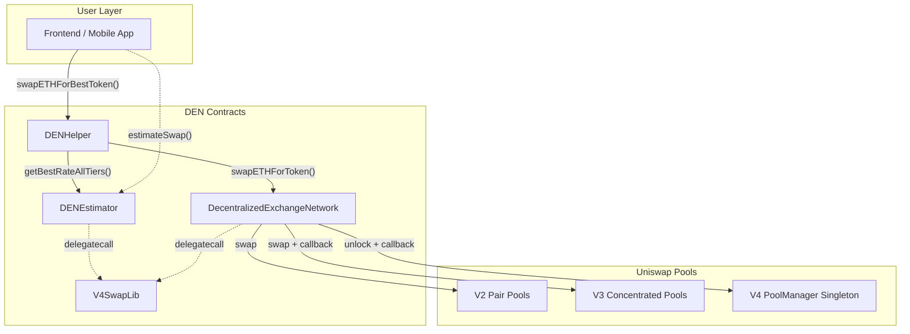

### Frontend Swap Flow (High Level)

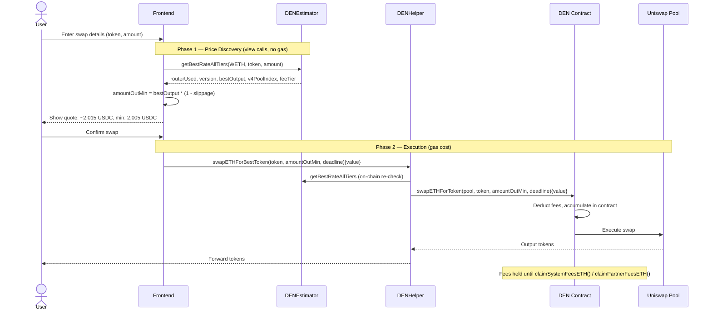

### ETH -> Token (V2 Path)

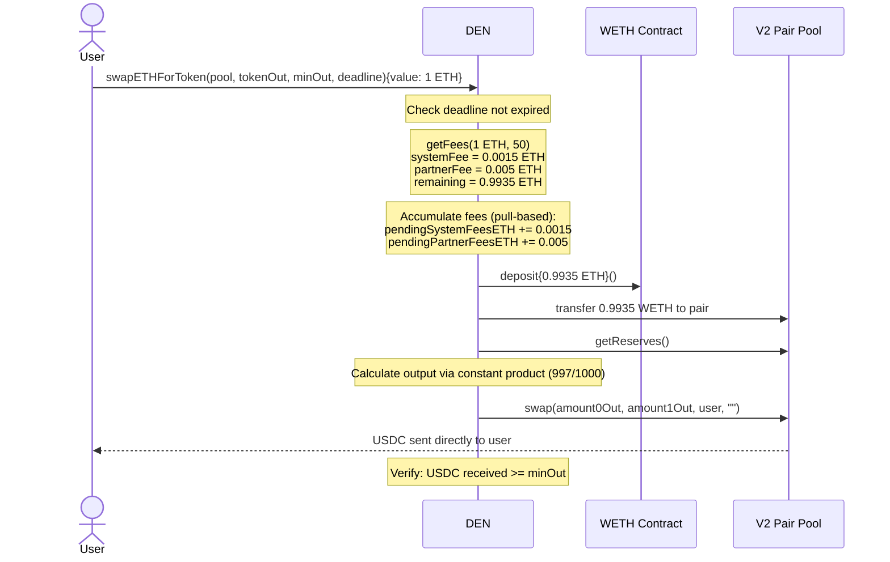

### ETH -> Token (V3 Path)

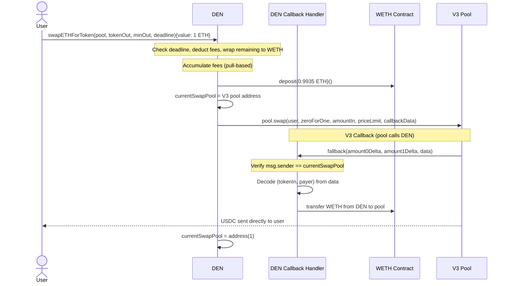

### ETH -> Token (V4 Path)

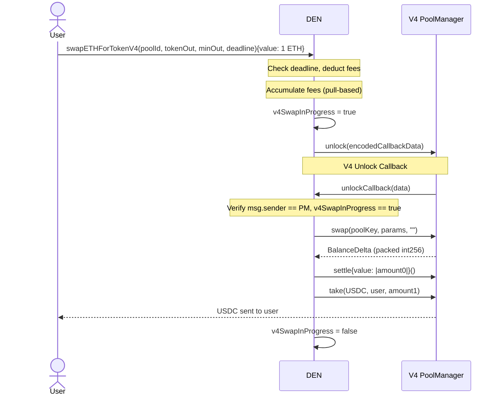

### Token -> ETH (All Versions)

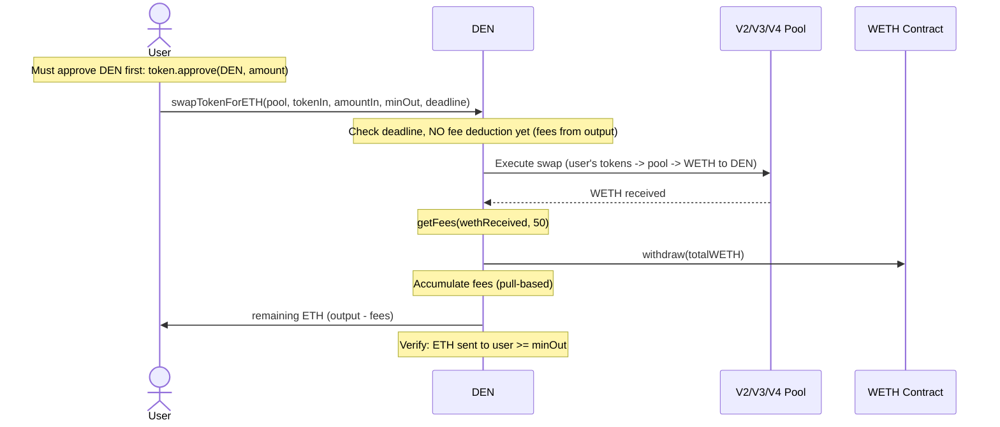

### Fee Claiming Flow

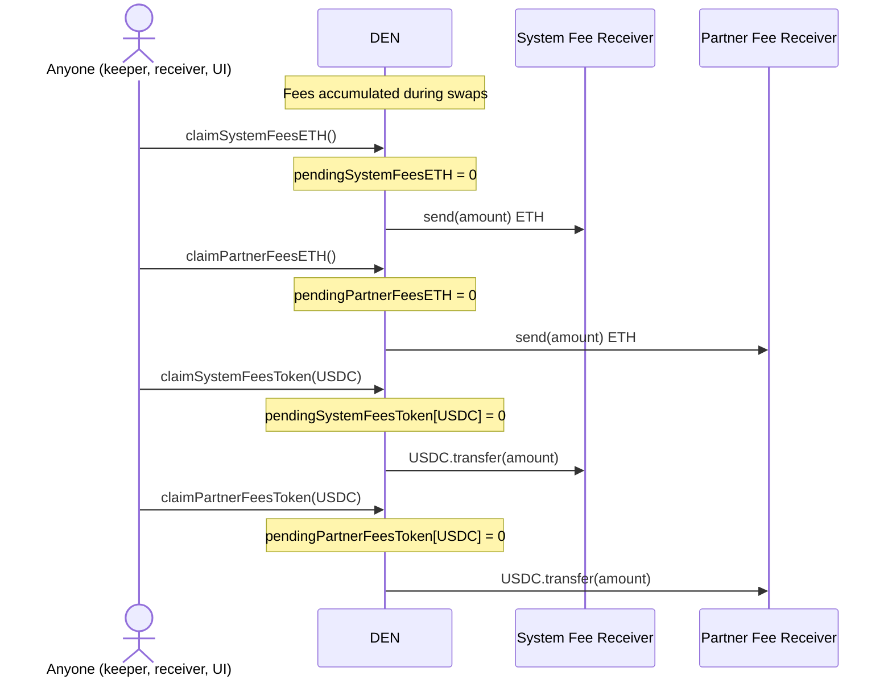

### Fee Deduction Timing

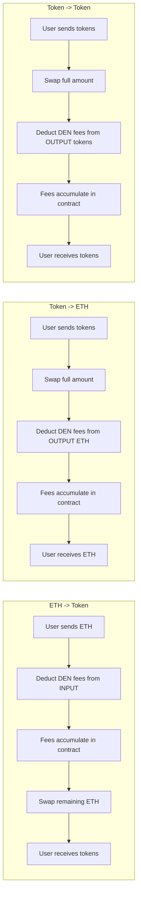

### V3 Callback Security

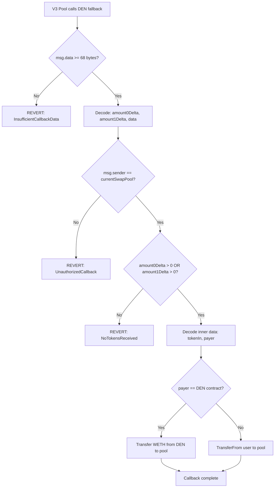

### V4 Callback Security

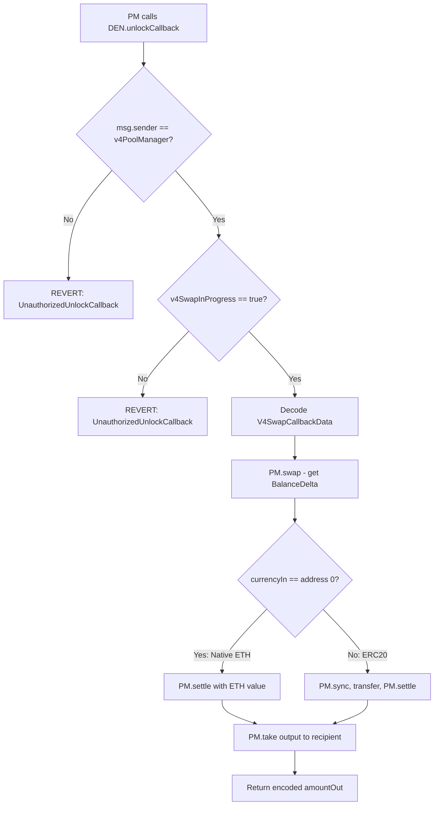

### Deployment Order

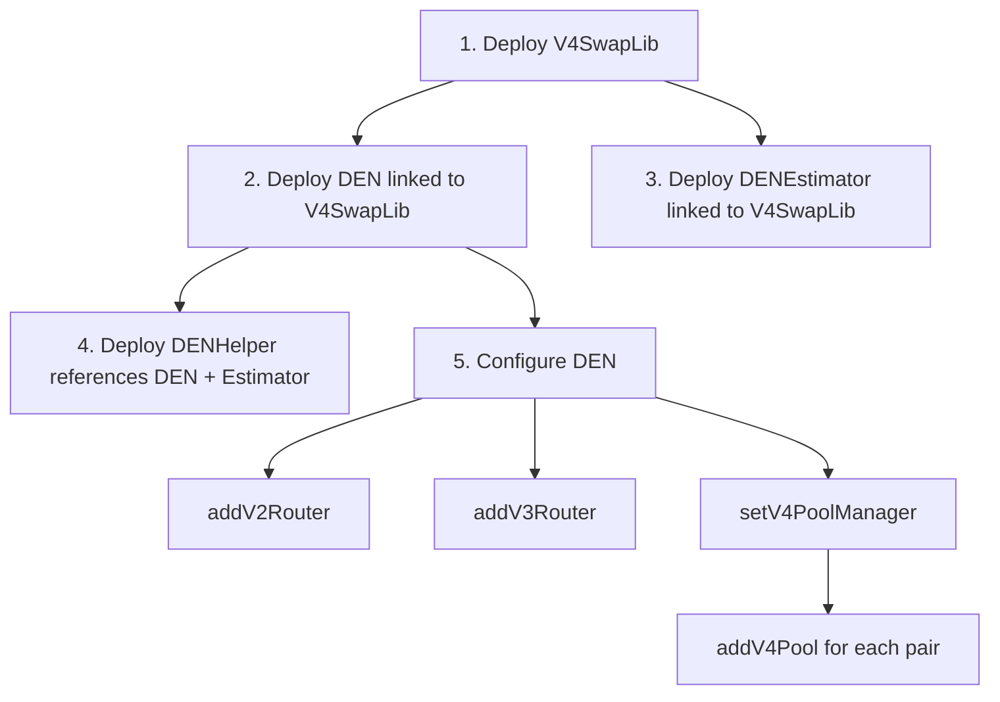

---

## Testing

```bash
npm install
npx hardhat test
```

**166 tests** covering:
- All swap directions on V2 and V3 (ETH->Token, Token->ETH roundtrips)
- V4 pool management, rate checking, and error paths
- Fee calculation precision and zero-value edge cases
- Exploit path analysis (callback manipulation, approval drainage, reentrancy, payer spoofing)
- Tax token (fee-on-transfer) compatibility across V2 pools at 5%, 10%, and 25% tax rates
- Rate shopping across V2 + V3 + V4
- Emergency functions, access control, and partner management
- Sequential and concurrent swap state integrity

V4 swap execution tests require a Cancun-compatible fork (transient storage). The Hardhat Base fork has a known limitation ([#5511](https://github.com/NomicFoundation/hardhat/issues/5511)) that prevents V4 PoolManager interaction in fork mode. V4 swap tests are marked pending and need Base Sepolia testnet validation.

## Target Chain

Base (Chain ID 8453). The Hardhat config forks Base mainnet for testing.

## Limitations

- **Single-hop only** — no multi-hop routing across multiple pools
- **Pool awareness required** — the caller must specify the pool (V2/V3) or pool ID (V4) when using DEN directly; use `DENHelper` for automatic routing
- **WETH cannot be tokenIn or tokenOut** — use the ETH swap functions for native ETH
- **V4 pool keys must be canonically ordered** — `currency0 < currency1`
- **Fee receiver must accept ETH** — if a fee receiver contract reverts on ETH receive, fee claiming will fail (swaps are unaffected)

## Credit

David Wyly (main author)
DeFi Mark (contributor)
