# DEN Swap Flow Diagrams

## System Architecture

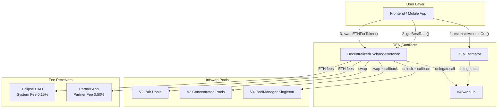

## Frontend Swap Flow (High Level)

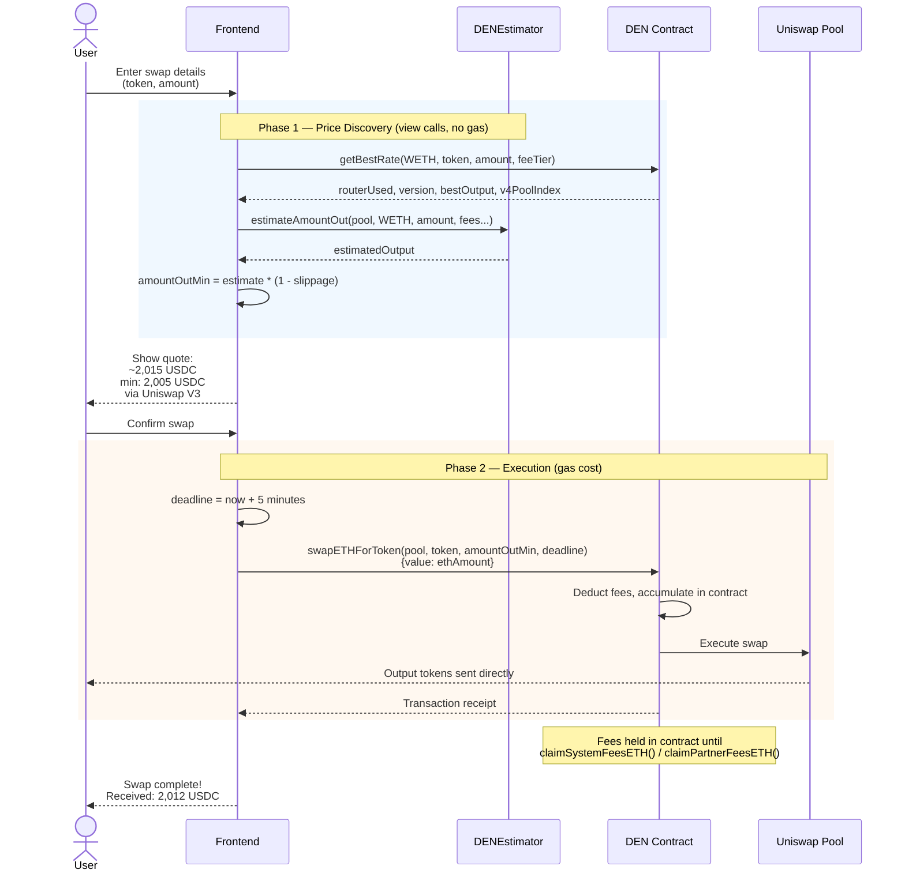

## ETH → Token (V2 Path)

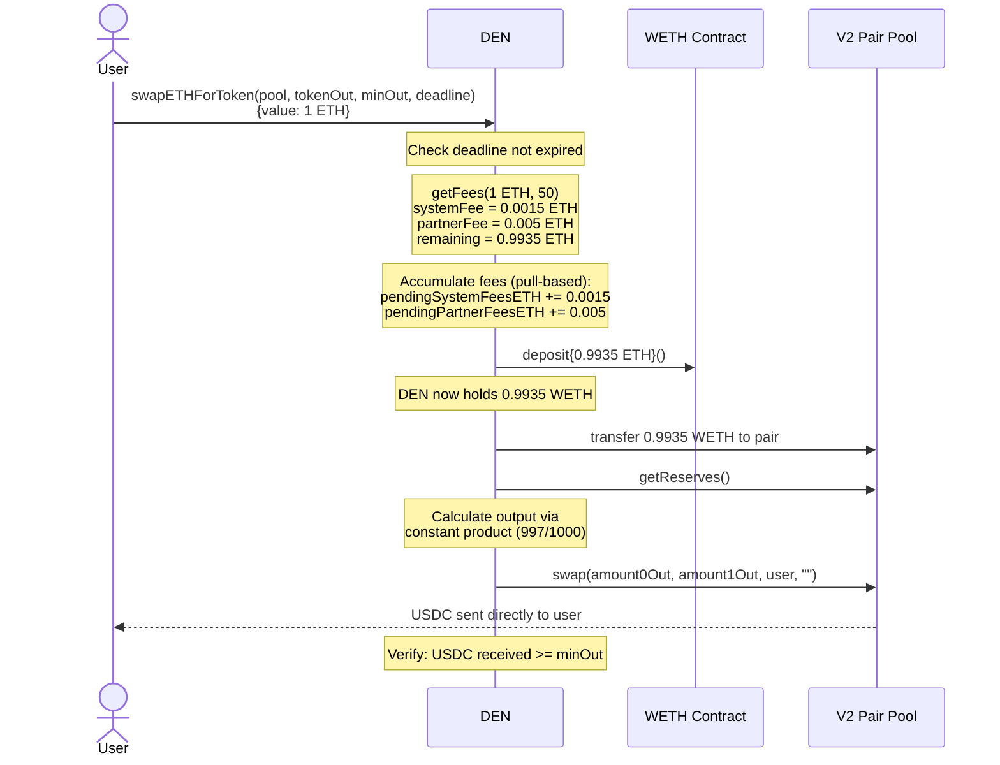

## ETH → Token (V3 Path)

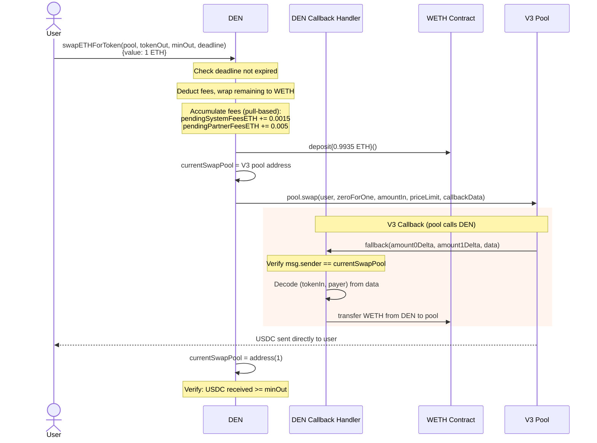

## ETH → Token (V4 Path)

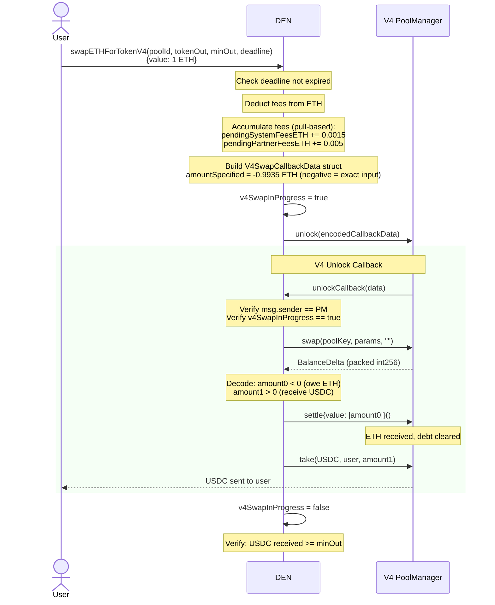

## Token → ETH (All Versions)

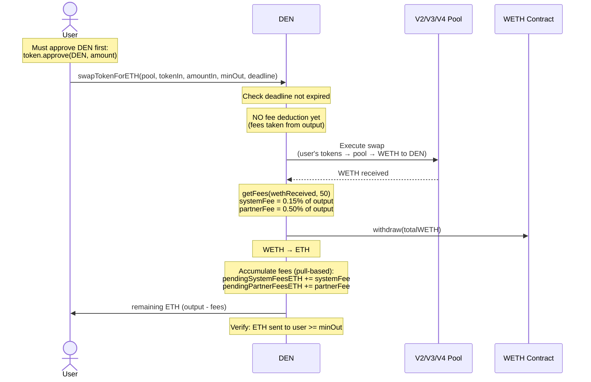

## Fee Claiming Flow

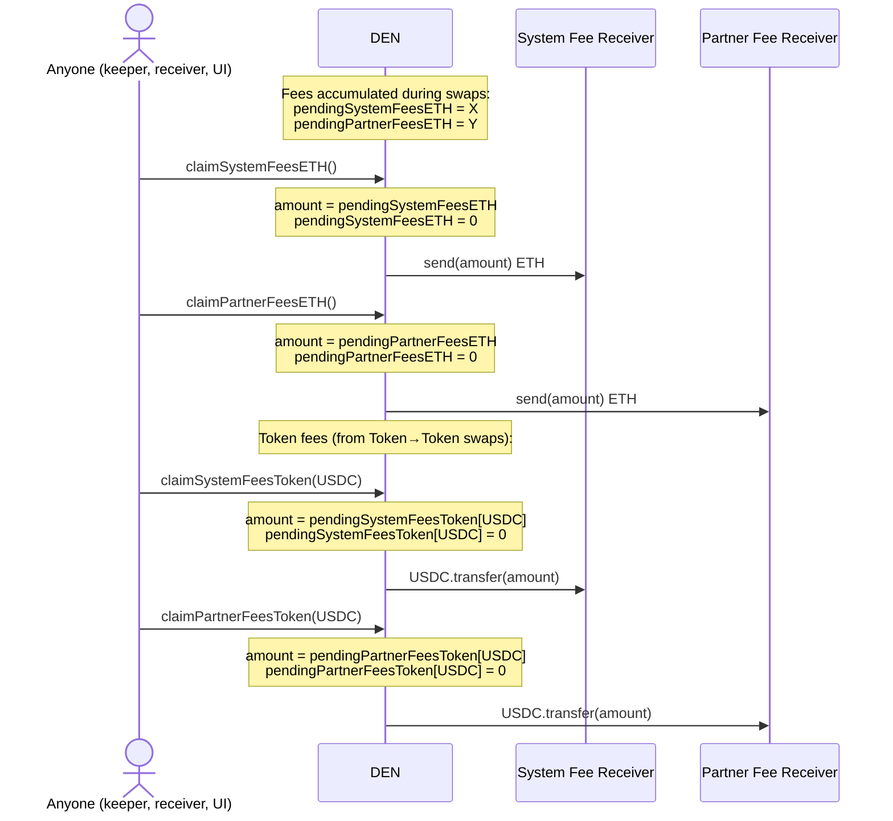

## Rate Shopping Flow

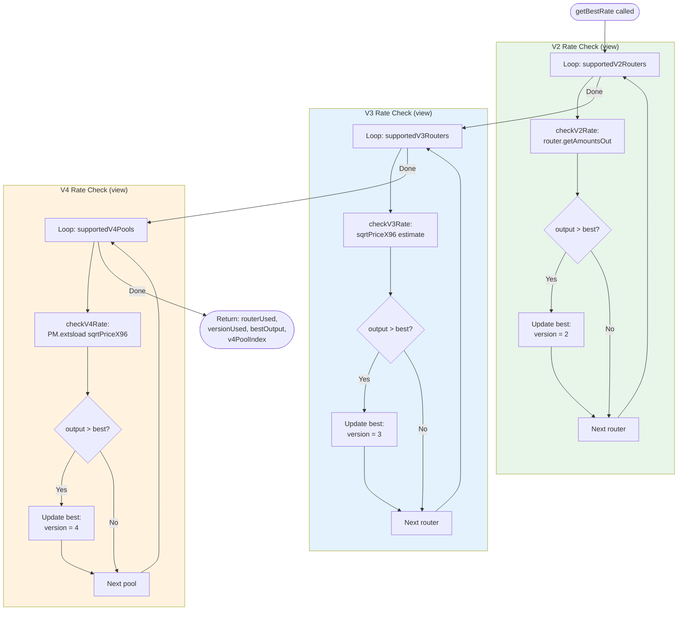

## Fee Deduction Timing

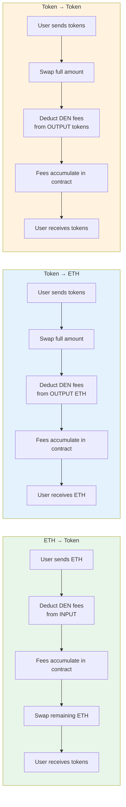

**Note:** All fees are pull-based. They accumulate inside the DEN contract during swaps. System and partner fee receivers claim their pending fees by calling `claimSystemFeesETH()` / `claimPartnerFeesETH()` (for ETH) or `claimSystemFeesToken(token)` / `claimPartnerFeesToken(token)` (for tokens). Anyone can trigger a claim — the funds always go to the designated receiver.

## V3 Callback Security Model

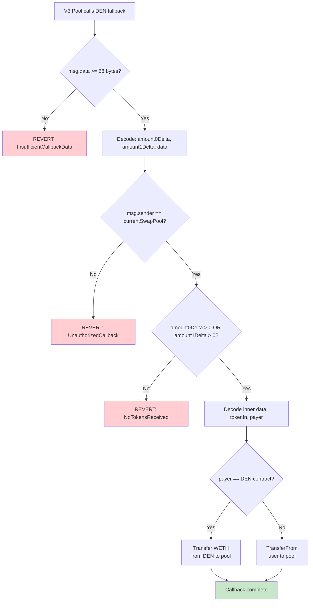

## V4 Callback Security Model

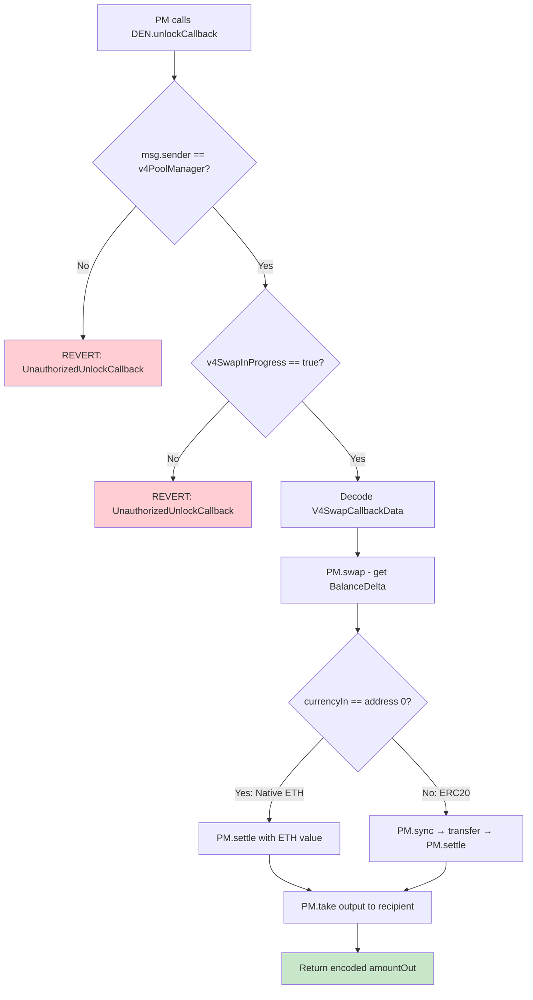

## Access Control Model

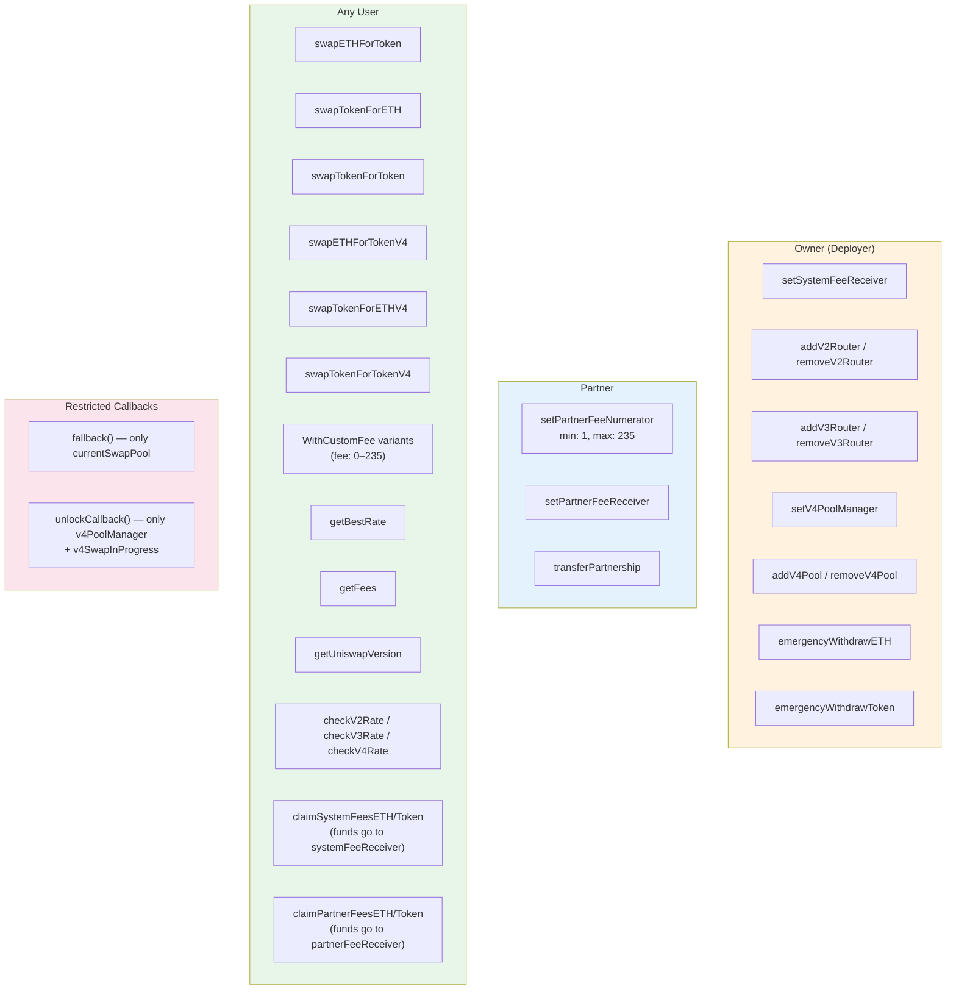

## Contract Deployment Order

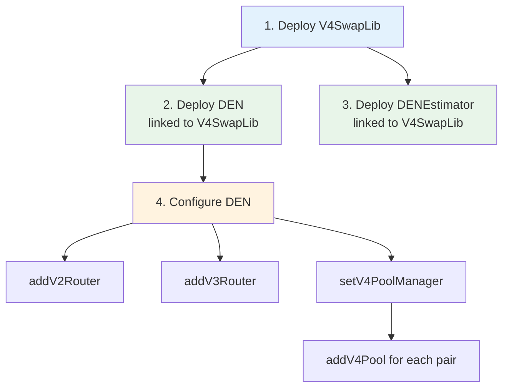
